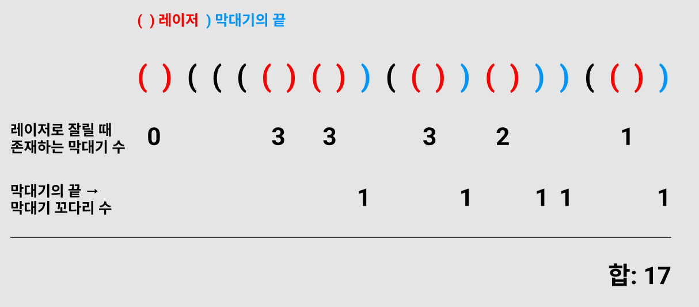

# 결과
| 메모리(KB) | 시간(ms) | 비고 |
| :---: | :---: | :-- |
| 13700 | 264 |  | 

# 과정
## 아이디어
문제를 통해 몇가지 정보를 얻어낼 수 있었다.

1. 같은 괄호지만, 인접한 괄호는 레이저를 의미하고 떨어진 괄호는 막대기를 의미한다.
2. 닫힌 괄호 `)`는 해당 괄호로 만들어진 결과가 레이저인지 혹은 막대기의 끝인지를 알려준다.
3. `)`를 통해 레이저가 완성됐다면, 레이저를 만드는 `(`를 제외하고 여태 쌓아올린 `(`의 갯수가 뚫고 지나가는 막대기의 수가된다.
4. `)`이 막대기의 끝을 나타냈다면, 레이저로 잘린 구간 이후부터 해당 구간까지 한 조각이 생기게 된다.

이를 그림으로 나타내면 아래와 같다.

이를 고려해서 `)`가 어떤 역할을 하는 괄호인지를 체크하는 방식으로 문제를 풀었다. 